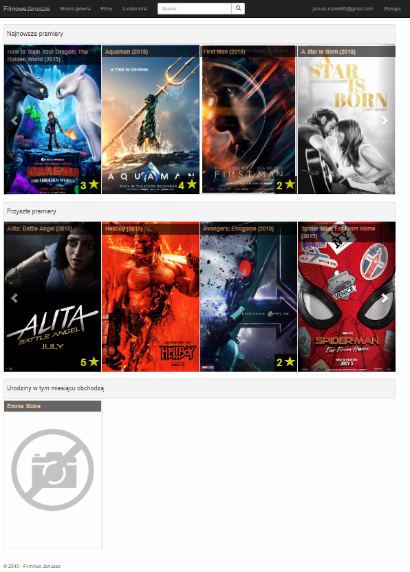

# FilmoweJanusze
> Web application created in ASP.NET MVC for my personal treaning. FilmoweJanusze is social platform, where users can add, edit and even rate movies and peoples which works around this movies (e.g actors, directors etc.)

## Table of contents
* [General info](#general-info)
* [Screenshots](#screenshots)
* [Technologies](#technologies)
* [Features](#features)
* [Startup](#startup)
* [Status](#status)
* [Inspiration](#inspiration)
* [Contact](#contact)

## General info
It is my first middle size project in .NET. I have created it because I wanted to learn programming web technologies in practical way.
I have learned how tu use Code First methology with Database migrations with EntityFramework. 
Users registered in application can create and edit movies and peoples (CRUD), but deleting is only provided for admin users. Users can also add/edit cast of movies and add photos to photo gallery and rate every movie and people.

## Screenshots

<br/>More screenshots in <i>img</i> folder.

## Technologies
* .NET Framework - version 4.6.1
* ASP.NET MVC - version 5.2.7
* EntityFramework - version 6.2.0
* JQuery - version 3.3.1
* Boostrap - version 3.3.7

## Features
List of ready features
* CRUD for entities
* Sorting and filtration mode using AJAX
* Relationships entities (e.g Movie -> Cast -> PhotoGallery)
* Using carousels in home view for last related / not yet related movies and in photo gallery
* User side validation using JS, JSON functions and server side validation using C# attributes
* Search bar with autocomplete (JQuery.UI)
* Site is responsive (Bootstrap)
* Using Partial Views and Html Helpers to avoid repeating code (DRY)
* List of rated entities with rate bar chart
* Modal Register form with reCaptcha
* Pop-up Login form
* Optimistic concurrency 
* Seed data and users

 and many others... 

## Startup
To seed data you can write down command in <i>Package Manager Console</i>
```
update-database
```
or you can go to page
```
https://localhost:{port}/Home/Seed
```
after that application will seed initial data to your database and you can login as the Administrator user
```
username: Admin
password: Qwerty123!
```
or as normal User
```
username: User
password: Qwerty123!
```
or you can create your own account.

## Status
Project is _finished_. Right now I am learning other technology - ASP.NET Core.

## Inspiration
Project inspired by [Filmweb](https://www.filmweb.pl).

## Contact
Created by [Janusz Marek](https://www.linkedin.com/in/janusz-marek/) - feel free to contact me!
